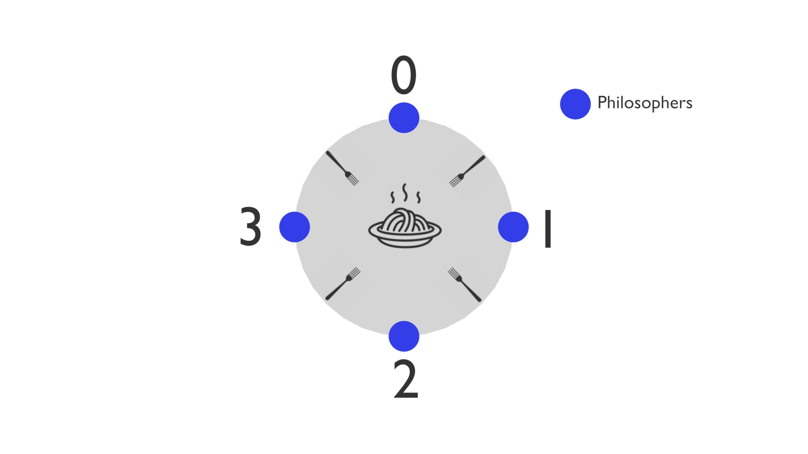

# Philosophers


This project is about implementing a solution to the classic philosphers dining problem.
We have a few philosophers sitting around a circular table.
Between each pair of philosophers lies a spoon.
To eat, a philosopher must hold two spoons — one in each hand.
In the middle of the table is the shared limited food.

#### How can we schedule spoon usage so that no philosopher starves?

The key to solving the Dining Philosophers is to ensure two properties simultaneously:

- No deadlock: the system always makes progress — no philosopher is stuck forever waiting.
- No starvation: every philosopher who wants to eat will eventually get a turn.

### Why this matters

The philosphers dining problem refers to the classical synchronization problem in an operating system and illustrates the issue when mutiple threads or processes access shared resources in memory without coordination.

Without careful design, competing threads can fall into:
- deadlocks:  All threads wait forever for resources held by others.
- Racecondition: unpredictable behaviour of variables in common

This problem is a well-known synchronization challenge in concurrent programming, used to illustrate how multiple threads can share resources safely without conflicts.

---
## 📚 Table of Contents
- [Project Structure](#-project-structure)
- [Installation](#-Installation)
- [Usage](#-Usage)
- [How does it work](#-How-does-it-work)
- [Tests](#-Tests)
---
## 📂 Project Structure
```
philosophers/
├─ Makefile
├─ README.md
├─ include/
│  └─ philo.h
├─ src/
│  ├─ free.c               // functions to free memory from heap
│  ├─ init.c               // allocates and initializes philos, mutex locks and threads
│  ├─ monitore.c           // monitores all simulation condition(death of philos, starvation) 
│  ├─ routine1.c           // grap forks
│  ├─ routine.c            // philosopher loop eat(), sleep_time(), thinking()
│  ├─ threads.c            // thread create/join
│  ├─ time.c               // time functions
│  └─ utils.c              // allocation, destroy, print message
└─ tests/
   └─ scenarios.sh        // quick runs for common/edge cases
|
└─ picures/
   └─ 0012.jpg
```
---
## 🛠️ Installation
Clone the repo:
```bash
git clone https://github.com/WaPoco/Philosophers
```
Change directory:
```
cd Philosophers
```
Create the binary:
```
make
```
Clean up at the end:
```
make fclean
```
---
## Usage

```bash
./Philosophers n t_die t_eat t_sleep must_eat
```
### Arguments
- ```n```       number of philosophers and forks
- ```t_die```   time in ms that past after the last meal. After that duration a philospher will starve to death.
- ```t_eat```   time in ms that a philosopher needs during eating
- ```t_sleep``` time in ms that a philosopher needs during sleeping
- ```must_eat```number of times each philosopher should eat atleast

Output:
```
time_past | i-philosopher | state of a philosopher(thinking, eating, grabing or sleeping)
```
    
### Example
```./Philosophers 5 400 200 200```

Output:
```
0 0 is thinking
0 0 has taken a fork
0 0 has taken a fork
0 0 is eating
0 1 is thinking
0 1 has taken a fork
0 2 is thinking
0 3 is thinking
200 0 is sleeping
200 3 has taken a fork
200 3 has taken a fork
200 3 is eating
200 1 has taken a fork
200 1 is eating
401 0 is thinking
401 0 died
```
---
## How does it work

1. Resource‐Hierarchy (Numbering) Strategy

Number the spoons from 0 through n–1 (in a circle).
Always pick up the lower‐numbered spoon first, then the higher‐numbered one.
Philosopher i sees two spoons: spoon i (on the right) and spoon (i+1)%n on the left.
- If i < (i+1)%n he grabs spoon i first;
- otherwise he grabs spoon (i+1)%n first.
## Tests
1.Test: No dataraces, deadlocks
```valgrind --tool=helgrind ./Philosophers ...```

2.Test:

```./Philosophers 1 800 200 200```
